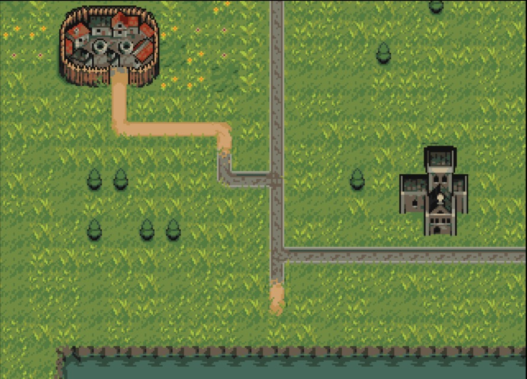

# Multi-directional large tilemaps scrolling with TileBuffer

## Basic description

This tutorial will focus on multi-directional scrolling as used for RPG or games like Alien Breed, Chaos Engine or large platform game like Turrican or Superfrog.

Although you could use simpleBuffer for drawing and scrolling large tilemaps, it would eat a lot of RAM. In order to do this efficiently, you need to use the [managers/viewport/tilebuffer.h](../../include/ace/managers/viewport/tilebuffer.h). It's specifically design for drawing tiles and scrolling in any direction.

## Prerequisites

The tile manager takes 2 pre-requisites :

1. a set of tiles
2. a map using this tiles.

Last pre-requisites, you need the *palette* linked to your tiles graphic. [See Palette Tutorial](./palette.md)

### Prepare the set of tiles

Let's use this resource from open game art: https://opengameart.org/content/overworld-grass-biome

Get `TilesetGrass/overworld_tileset_grass.png` and convert it in 32 colors (use [grafx2](http://grafx2.chez.com/) for example).

Now Select [Aseprite](https://www.aseprite.org/]).

1. Do `File > Import > Import Sprite Sheet`  Select 16x16 sprites option.

2. On the palette editor, reduce the palette to 32 colors. Remove all useless black square after the 32nd colors.

3. Use plugin [Aseprite Script: Amiga OCS/ECS Color Palette Mixe](https://prismaticrealms.itch.io/aseprite-script-amiga-ocsecs-color-palette-mixer) to align png and palette to amiga capacity/rgb colors.

4. Select `File > Export >  Export Sprite Sheet` and then `File > Saves As` and save as `overworld.png`. You must choose **Vertical Strip** for ACE tileBuffer.

The file is ready for use here : [overworld.png](./res/overworld.png)

Also, be sure to [export the palette](./palette.md) as `overworld.gpl`

The palette file is ready for use here : [overworld.gpl](./res/overworld.gpl)

### Prepare the map

You need to use [Tiled](https://www.mapeditor.org/)

And install this addon : https://github.com/youenchene/tiled-export-to-amiga

1. Go to `Settings`
2. Then `Plugins`
3. Click Open after the Directory, and copy inside `gogitum.mjs`  

On **Tiled** :

1. Create new Project
2. Click on `New Tileset...`
3. Load `overworld.png` set it to 16 x 16
4. Then `New Map...`
5. Choose `Orthogonal`, `CSV` and `Right Down`, `200` tiles x `100` tiles and `16px` tile size
6. Draw a map
7. `File > Export As...`
8. Choose `GOGITUM Export ACE - pTileData (UBYTE)` format and export as `overworld.dat` in your res `folder`.


The map file is ready for use here : [overworld.dat](./res/overworld.dat)

### Recap

In your `res` folder you should have :

- `overworld.dat` (map)
- `overworld.gpl` (palette)
- `overworld.png` (tiles)

## Let's Code

### Assets Preprocessing

First, append your `CMakeLists.txt` file and add at the end. 

It loads and converts the palette and then use it to convert your tiles file. It also loads the map file.

```cmake
# Convert palette and background image
convertPalette(${GAME_LINKED} ${RES_DIR}/overworld.gpl ${DATA_DIR}/overworld.plt)
convertBitmaps(
  TARGET ${GAME_LINKED} PALETTE ${RES_DIR}/overworld.gpl
  INTERLEAVED SOURCES ${RES_DIR}/overworld.png
  DESTINATIONS ${DATA_DIR}/overworld.bm
)

file(COPY ${RES_DIR}/overworld.dat DESTINATION ${DATA_DIR})
```

### Update your game.c

Then on on your `game.c` or equivalent.

Declare constants and main static variables

```c
#define TILE_MAP_SIZE_X 200
#define TILE_MAP_SIZE_Y 80
#define GAME_BPP 5 // 32 colors
#define SCORE_HEIGHT 16

// View containing all the viewports
static tView *s_pView; 
// For score - won't be used in this tuto
static tVPort *s_pVpScore; // Viewport for score
static tSimpleBufferManager *s_pScoreBuffer;
// Viewport for playfield
static tVPort *s_pVpMain; 
// Your buffer manager, it will handle your scrolling
static tTileBufferManager *s_pMainBuffer;
// Tiles
static tBitMap *s_pTiles;
// Palette
static UWORD s_pPalette[1 << GAME_BPP];

static UWORD s_uwMapTileWidth;
static UWORD s_uwMapTileHeight;
//[...]
// To controle camera/view on scrolling
UWORD g_uwCameraX=0;
UWORD g_uwCameraY=0;
UWORD g_uwCameraSpeed=2;
//[...]

```

Then, add a function to load your map. The map is loaded column by column for speed purpose :

```c
static void loadMap(void) {
    logWrite("Map Loading...\n");
    tFile *pFileTilemap = diskFileOpen("data/overworld.dat", "rb");
    fileRead(pFileTilemap, &s_uwMapTileWidth, sizeof(s_uwMapTileWidth));
    fileRead(pFileTilemap, &s_uwMapTileHeight, sizeof(s_uwMapTileHeight));
    s_uwMapTileWidth++;
    s_uwMapTileHeight++;
    logWrite("Map Width %u",s_uwMapTileWidth);
    logWrite("Map Height %u",s_uwMapTileHeight);
    for (int x = 0; x < s_uwMapTileWidth; x++) {
        fileRead(pFileTilemap, s_pMainBuffer->pTileData[x], s_uwMapTileHeight);
    }
    fileClose(pFileTilemap); 
    logWrite("Map Loaded!\n");
}
```

And this function (in a next iteration of the tutorial I will be able to explain this one) :
```c
static void onTileDraw(
    UWORD uwTileX, UWORD uwTileY,
    tBitMap *pBitMap, UWORD uwBitMapX, UWORD uwBitMapY
) {
}
```

Then, in your `gameGsCreate` function:

```c
// To move scrolling
keyCreate();
joyOpen();

s_pView = viewCreate(0, TAG_END);

// Viewport for score bar - on top of screen
s_pVpScore = vPortCreate(0,
    TAG_VPORT_VIEW, s_pView,
    TAG_VPORT_BPP, GAME_BPP,
vTAG_VPORT_HEIGHT, SCORE_HEIGHT,
TAG_END);

s_pScoreBuffer = simpleBufferCreate(0,
    TAG_SIMPLEBUFFER_VPORT, s_pVpScore,
    TAG_SIMPLEBUFFER_BITMAP_FLAGS, BMF_CLEAR,
    TAG_SIMPLEBUFFER_BOUND_WIDTH, 320,
    TAG_SIMPLEBUFFER_BOUND_HEIGHT, SCORE_HEIGHT,
TAG_END);

// Now let's do the same for main playfield where the scrolling happen
s_pVpMain = vPortCreate(0,
    TAG_VPORT_VIEW, s_pView,
    TAG_VPORT_BPP, GAME_BPP,
TAG_END);

// Load tiles
s_pTiles = bitmapCreateFromPath("data/overworld.bm", 0);

logWrite("Tiles Loaded!\n");

// Init your scrolling tile buffer 
s_pMainBuffer = tileBufferCreate(0,
    TAG_TILEBUFFER_VPORT, s_pVpMain,  // Select View Port
    TAG_TILEBUFFER_BITMAP_FLAGS, BMF_CLEAR | BMF_INTERLEAVED,  // If you put interleaved there, it should be also in your cmakelist part.
    TAG_TILEBUFFER_BOUND_TILE_X, TILE_MAP_SIZE_X, // Map size in number of tile
    TAG_TILEBUFFER_BOUND_TILE_Y, TILE_MAP_SIZE_Y, // Map size in number of tile
    TAG_TILEBUFFER_IS_DBLBUF, 1, // Activatey double buffering
    TAG_TILEBUFFER_TILE_SHIFT, 4, //Size of tile, given in bitshift. Set to 4 for 16px, 5 for 32px, etc. Mandatory.
    TAG_TILEBUFFER_REDRAW_QUEUE_LENGTH, 200, // cursor between handling fast scrolling versus your amiga power
    TAG_TILEBUFFER_CALLBACK_TILE_DRAW, onTileDraw, // To be documented
    TAG_TILEBUFFER_TILESET, s_pTiles,
TAG_END);


// Load and apply palette
paletteLoadFromPath("data/overworld.plt", s_pPalette, 1 << GAME_BPP);
memcpy(s_pVpScore->pPalette, s_pPalette, sizeof(s_pVpScore->pPalette));
memcpy(s_pVpMain->pPalette, s_pPalette, sizeof(s_pVpMain->pPalette));


loadMap();

//IO operations end here - let's unload the OS and display some stuff
systemUnuse();

logWrite("Camera Reset\n");
cameraReset(s_pMainBuffer->pCamera, 0, 0, s_uwMapTileWidth*16, s_uwMapTileHeight * 16, 1);

// Initial draw
tileBufferRedrawAll(s_pMainBuffer);

// Set initial camera
cameraSetCoord(s_pMainBuffer->pCamera, g_uwCameraX, g_uwCameraY);

// Load & Display the view
viewLoad(s_pView);
```

And in your `gameGsDestroy` method to unload memory :

```c
void gameGsDestroy(void) {
    systemUse();
    bitmapDestroy(s_pTiles);
    viewDestroy(s_pView);
    keyDestroy();
    oyClose(); 
}
```

Finally let's control our scrolling in `gameGsLoop`:

```c
// Handle keyboard and joystick events
keyProcess();
joyProcess();
//[...]//
// Let's control your scrolling
// Q for speeding up (A in azerty keyboard)
// W for speeding down (Z in azerty keyboard)
WORD wDx = 0, wDy = 0;
if(keyCheck(KEY_Q)) {
    g_uwCameraSpeed+=1;
}
if(keyCheck(KEY_W)) {
    if(g_uwCameraSpeed>1) {
        g_uwCameraSpeed-=1;
    }
}
// Joy direction to move
if(joyCheck(JOY1_UP || keyCheck(KEY_UP))) {
    wDy=-1*g_uwCameraSpeed;
}
if(joyCheck(JOY1_DOWN) || keyCheck(KEY_DOWN)) {
    wDy=g_uwCameraSpeed;
}
if(joyCheck(JOY1_LEFT) || keyCheck(KEY_LEFT)) {
    wDx=-1*g_uwCameraSpeed;
}
if(joyCheck(JOY1_RIGHT)|| keyCheck(KEY_RIGHT)) {
    wDx=g_uwCameraSpeed;
}
cameraMoveBy(s_pMainBuffer->pCamera, wDx, wDy);
//[...]//
// Process scrolling Mandatory
viewProcessManagers(s_pView);
// Process Copper list - mandatory
copProcessBlocks();
// Wait for end of frame
vPortWaitForEnd(s_pVpMain); 
```

At the end you should scroll over the map :


